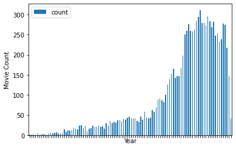
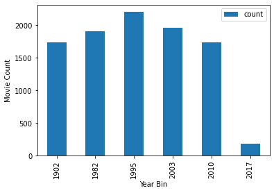
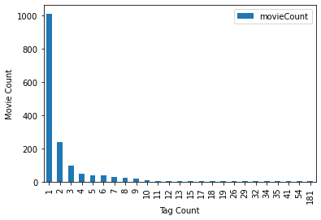

# Project 3 - Clustering
### Author: Jace Kline

### Goal
We shall try to build one or more clustering models to determine similar movies from a dataset containing user ratings and tags.

### Main Objectives
1. Obtain datasets from MovieLens and load them into Pandas
2. Formulate ideas on how the ratings and tags by users can be used to add additional value to the datasets through use of exploratory data analysis
3. Perform feature engineering using above ideas to extract additional value from the datasets
4. Build clustering models to attempt to group similar movies together


```python
# General imports
import sys
sys.path.append('../src/')

import re
import numpy as np
import pandas as pd
from matplotlib import pyplot as plt
%matplotlib inline
```

## Loading the Data
First, we must load the data into Pandas. There are two separate datasets that we must load:
* 'tags.csv' -> The fields are: userId, movieId, tag, timestamp
* 'movies.csv' -> The fields are: movieId, title, genres


```python
data_dir = '../data/initial/'

# Load the Tags dataset
df_tags = pd.read_csv(data_dir + 'tags.csv')

df_tags.head()
```


<div>
<style scoped>
    .dataframe tbody tr th:only-of-type {
        vertical-align: middle;
    }

    .dataframe tbody tr th {
        vertical-align: top;
    }

    .dataframe thead th {
        text-align: right;
    }
</style>
<table border="1" class="dataframe">
  <thead>
    <tr style="text-align: right;">
      <th></th>
      <th>userId</th>
      <th>movieId</th>
      <th>tag</th>
      <th>timestamp</th>
    </tr>
  </thead>
  <tbody>
    <tr>
      <th>0</th>
      <td>2</td>
      <td>60756</td>
      <td>funny</td>
      <td>1445714994</td>
    </tr>
    <tr>
      <th>1</th>
      <td>2</td>
      <td>60756</td>
      <td>Highly quotable</td>
      <td>1445714996</td>
    </tr>
    <tr>
      <th>2</th>
      <td>2</td>
      <td>60756</td>
      <td>will ferrell</td>
      <td>1445714992</td>
    </tr>
    <tr>
      <th>3</th>
      <td>2</td>
      <td>89774</td>
      <td>Boxing story</td>
      <td>1445715207</td>
    </tr>
    <tr>
      <th>4</th>
      <td>2</td>
      <td>89774</td>
      <td>MMA</td>
      <td>1445715200</td>
    </tr>
  </tbody>
</table>
</div>


```python
# Load the Movies dataset
df_movies = pd.read_csv(data_dir + 'movies.csv')

df_movies.head()
```


<div>
<style scoped>
    .dataframe tbody tr th:only-of-type {
        vertical-align: middle;
    }

    .dataframe tbody tr th {
        vertical-align: top;
    }

    .dataframe thead th {
        text-align: right;
    }
</style>
<table border="1" class="dataframe">
  <thead>
    <tr style="text-align: right;">
      <th></th>
      <th>movieId</th>
      <th>title</th>
      <th>genres</th>
    </tr>
  </thead>
  <tbody>
    <tr>
      <th>0</th>
      <td>1</td>
      <td>Toy Story (1995)</td>
      <td>Adventure|Animation|Children|Comedy|Fantasy</td>
    </tr>
    <tr>
      <th>1</th>
      <td>2</td>
      <td>Jumanji (1995)</td>
      <td>Adventure|Children|Fantasy</td>
    </tr>
    <tr>
      <th>2</th>
      <td>3</td>
      <td>Grumpier Old Men (1995)</td>
      <td>Comedy|Romance</td>
    </tr>
    <tr>
      <th>3</th>
      <td>4</td>
      <td>Waiting to Exhale (1995)</td>
      <td>Comedy|Drama|Romance</td>
    </tr>
    <tr>
      <th>4</th>
      <td>5</td>
      <td>Father of the Bride Part II (1995)</td>
      <td>Comedy</td>
    </tr>
  </tbody>
</table>
</div>


## Feature Engineering Ideas
By observing the above datasets, we can perform some actions that will result in datasets with enhanced clustering potential. These ideas are as follows:
1. Extract the year from the 'title' column and make it into a separate numerical feature
    * We can further group the years into 5 year increments to increase clustering potential
2. Convert the 'genres' column into a vector of boolean (0 or 1) values for each entry
    * There are 18 possible genres
3. Map all entries in the 'tag' column to lowercase to ensure uniformity, then observe statistics on tag usage

### Extracting the year value from the 'title' column
We shall first dissect the 'title' column and split it into the title and the year. This is important because the numerical year value is a tangible feature that we can use in our clustering model.


```python
def extract(capture_group):
    year_regex = '([^(]*)[(]([0-9]{4})[)]'
    def f(row):
        m = re.search(year_regex,row.title)
        if m is not None:
            return (int(m.group(2)) if capture_group == 2 else str(m.group(1)))
        else:
            return np.nan
    return (lambda r: f(r))
 
def extractYear(row):
    return extract(2)(row)
    
def removeYear(row):
    return extract(1)(row)

df_movies['year'] = df_movies.apply(extractYear, axis=1)
df_movies['year'] = df_movies['year'].fillna(df_movies['year'].mean()).astype(np.short)

df_movies['title'] = df_movies.apply(removeYear, axis=1)

df_movies.head()
```


<div>
<style scoped>
    .dataframe tbody tr th:only-of-type {
        vertical-align: middle;
    }

    .dataframe tbody tr th {
        vertical-align: top;
    }

    .dataframe thead th {
        text-align: right;
    }
</style>
<table border="1" class="dataframe">
  <thead>
    <tr style="text-align: right;">
      <th></th>
      <th>movieId</th>
      <th>title</th>
      <th>genres</th>
      <th>year</th>
    </tr>
  </thead>
  <tbody>
    <tr>
      <th>0</th>
      <td>1</td>
      <td>Toy Story</td>
      <td>Adventure|Animation|Children|Comedy|Fantasy</td>
      <td>1995</td>
    </tr>
    <tr>
      <th>1</th>
      <td>2</td>
      <td>Jumanji</td>
      <td>Adventure|Children|Fantasy</td>
      <td>1995</td>
    </tr>
    <tr>
      <th>2</th>
      <td>3</td>
      <td>Grumpier Old Men</td>
      <td>Comedy|Romance</td>
      <td>1995</td>
    </tr>
    <tr>
      <th>3</th>
      <td>4</td>
      <td>Waiting to Exhale</td>
      <td>Comedy|Drama|Romance</td>
      <td>1995</td>
    </tr>
    <tr>
      <th>4</th>
      <td>5</td>
      <td>Father of the Bride Part II</td>
      <td>Comedy</td>
      <td>1995</td>
    </tr>
  </tbody>
</table>
</div>


### Assigning the 'year' feature to groups based on normalized increments
To increase the clustering potential of the 'year' column, we shall map each year to a more general group based on partitioned increments.


```python
yearcounts = pd.DataFrame(df_movies['year'].value_counts())
yearcounts.reset_index(level=0, inplace=True)
yearcounts.rename(columns={'index' : 'year', 'year' : 'count'}, inplace=True)
yearcounts['year'] = yearcounts['year'].astype('short')
yearcounts.sort_values(['year','count'], ascending=[1,1], inplace=True)
yearcounts.reset_index(level=0, inplace=True)
moviecount = yearcounts['count'].sum()
print("Total movies: {}".format(moviecount))
```

    Total movies: 9742


```python
yearcounts.plot.bar(x='year', y='count')
plt.xlabel('Year')
plt.ylabel('Movie Count')
plt.xticks(visible=False)
plt.savefig('../plots/yearcounts.png')
plt.show()
```





#### Grouping 'year' values - Next steps
Now that we have extracted the total number of movies and viewed the general distribution, we shall group the movies into 6 buckets based on their 'year' attribute.


```python
def yearBins(bins):
    yearbins = []
    bins_left = bins
    movies_left = moviecount
    yr = 0
    counter = 0
    for index, row in yearcounts.iterrows():
        if yr == 0:
            yr = row['year']
        if counter >= (movies_left / bins_left):
            yearbins.append(yr)
            bins_left = bins_left - 1
            movies_left = movies_left - counter
            counter = 0
            yr = row['year'] + 1
        else:
            counter += row['count']
    if len(yearbins) < bins:
        yearbins.append(yr)
    return yearbins
        
print('Year bins: {}'.format(yearBins(6)))
```

    Year bins: [1902, 1982, 1995, 2003, 2010, 2017]


Now that we have our 6 year bins, we shall map the current data to these bins.


```python
def yearBin(bins):
    bs = yearBins(bins)
    def f(row):
        for i in range(0,bins):
            if i == bins - 1:
                return bs[bins - 1]
            elif row['year'] >= bs[i] and row['year'] < bs[i+1]:
                return bs[i]
    return (lambda r: f(r))

df_movies['yearbin'] = df_movies.apply(yearBin(6),axis=1)
df_movies
```


<div>
<style scoped>
    .dataframe tbody tr th:only-of-type {
        vertical-align: middle;
    }

    .dataframe tbody tr th {
        vertical-align: top;
    }

    .dataframe thead th {
        text-align: right;
    }
</style>
<table border="1" class="dataframe">
  <thead>
    <tr style="text-align: right;">
      <th></th>
      <th>movieId</th>
      <th>title</th>
      <th>genres</th>
      <th>year</th>
      <th>yearbin</th>
    </tr>
  </thead>
  <tbody>
    <tr>
      <th>0</th>
      <td>1</td>
      <td>Toy Story</td>
      <td>Adventure|Animation|Children|Comedy|Fantasy</td>
      <td>1995</td>
      <td>1995</td>
    </tr>
    <tr>
      <th>1</th>
      <td>2</td>
      <td>Jumanji</td>
      <td>Adventure|Children|Fantasy</td>
      <td>1995</td>
      <td>1995</td>
    </tr>
    <tr>
      <th>2</th>
      <td>3</td>
      <td>Grumpier Old Men</td>
      <td>Comedy|Romance</td>
      <td>1995</td>
      <td>1995</td>
    </tr>
    <tr>
      <th>3</th>
      <td>4</td>
      <td>Waiting to Exhale</td>
      <td>Comedy|Drama|Romance</td>
      <td>1995</td>
      <td>1995</td>
    </tr>
    <tr>
      <th>4</th>
      <td>5</td>
      <td>Father of the Bride Part II</td>
      <td>Comedy</td>
      <td>1995</td>
      <td>1995</td>
    </tr>
    <tr>
      <th>...</th>
      <td>...</td>
      <td>...</td>
      <td>...</td>
      <td>...</td>
      <td>...</td>
    </tr>
    <tr>
      <th>9737</th>
      <td>193581</td>
      <td>Black Butler: Book of the Atlantic</td>
      <td>Action|Animation|Comedy|Fantasy</td>
      <td>2017</td>
      <td>2017</td>
    </tr>
    <tr>
      <th>9738</th>
      <td>193583</td>
      <td>No Game No Life: Zero</td>
      <td>Animation|Comedy|Fantasy</td>
      <td>2017</td>
      <td>2017</td>
    </tr>
    <tr>
      <th>9739</th>
      <td>193585</td>
      <td>Flint</td>
      <td>Drama</td>
      <td>2017</td>
      <td>2017</td>
    </tr>
    <tr>
      <th>9740</th>
      <td>193587</td>
      <td>Bungo Stray Dogs: Dead Apple</td>
      <td>Action|Animation</td>
      <td>2018</td>
      <td>2017</td>
    </tr>
    <tr>
      <th>9741</th>
      <td>193609</td>
      <td>Andrew Dice Clay: Dice Rules</td>
      <td>Comedy</td>
      <td>1991</td>
      <td>1982</td>
    </tr>
  </tbody>
</table>
<p>9742 rows × 5 columns</p>
</div>


#### Viewing the bins
As we can see above, the 'year' data has been mapped into our newly created bins in the 'yearbin' column. Below, we plot the new bins and show the movie count in each one. Due to the inability to exactly partition the data, the counts are not perfectly split, but they will work for our purposes. Each bin contains the movies that were released between the shown year and the year of the next bin.


```python
yearbincnts = pd.DataFrame(df_movies['yearbin'].value_counts())
yearbincnts.reset_index(level=0, inplace=True)
yearbincnts.rename(columns={'index' : 'yearbin', 'yearbin' : 'count'}, inplace=True)
yearbincnts['yearbin'] = yearbincnts['yearbin'].astype('short')
yearbincnts.sort_values(['yearbin','count'], ascending=[1,1], inplace=True)
yearbincnts.reset_index(level=0, inplace=True)

yearbincnts.plot.bar(x='yearbin', y='count')
plt.xlabel('Year Bin')
plt.ylabel('Movie Count')
plt.savefig('../plots/yearbins.png')
plt.show()
```





### Vectorizing the 'genres' column
Since the 'genres' column is inherently a grouping metric, we must convert the data into a form usable by our clustering models. We shall map each 'genres' row entry into an array of 18 boolean (0 or 1) values indicating which genres are present for a particular movie.


#### Vectorizing the 'genres' column
The first step to our transformation of this column shall be to use the SciKit-Learn CountVectorizer class to convert the text field into vectors.


```python
from sklearn.feature_extraction.text import CountVectorizer
```


```python
genres = ['Action', 'Adventure', 'Animation', 'Children', 'Comedy', 'Crime', 'Documentary', 
          'Drama', 'Fantasy', 'Film-Noir', 'Horror', 'Musical', 'Mystery', 'Romance', 'Sci-Fi',
          'Thriller', 'War', 'Western']
vectorizer = CountVectorizer( vocabulary=genres, token_pattern='[a-zA-Z\-]+', lowercase=False, binary=True, dtype=np.short )
genres_vector = vectorizer.fit_transform(df_movies['genres'])

#print('Vectorized Genre Data:\n{}'.format(genres_vector.toarray()))
df_genres = pd.DataFrame(data=genres_vector.toarray(), columns=genres, dtype=np.short)
df_genres.head()
```


<div>
<style scoped>
    .dataframe tbody tr th:only-of-type {
        vertical-align: middle;
    }

    .dataframe tbody tr th {
        vertical-align: top;
    }

    .dataframe thead th {
        text-align: right;
    }
</style>
<table border="1" class="dataframe">
  <thead>
    <tr style="text-align: right;">
      <th></th>
      <th>Action</th>
      <th>Adventure</th>
      <th>Animation</th>
      <th>Children</th>
      <th>Comedy</th>
      <th>Crime</th>
      <th>Documentary</th>
      <th>Drama</th>
      <th>Fantasy</th>
      <th>Film-Noir</th>
      <th>Horror</th>
      <th>Musical</th>
      <th>Mystery</th>
      <th>Romance</th>
      <th>Sci-Fi</th>
      <th>Thriller</th>
      <th>War</th>
      <th>Western</th>
    </tr>
  </thead>
  <tbody>
    <tr>
      <th>0</th>
      <td>0</td>
      <td>1</td>
      <td>1</td>
      <td>1</td>
      <td>1</td>
      <td>0</td>
      <td>0</td>
      <td>0</td>
      <td>1</td>
      <td>0</td>
      <td>0</td>
      <td>0</td>
      <td>0</td>
      <td>0</td>
      <td>0</td>
      <td>0</td>
      <td>0</td>
      <td>0</td>
    </tr>
    <tr>
      <th>1</th>
      <td>0</td>
      <td>1</td>
      <td>0</td>
      <td>1</td>
      <td>0</td>
      <td>0</td>
      <td>0</td>
      <td>0</td>
      <td>1</td>
      <td>0</td>
      <td>0</td>
      <td>0</td>
      <td>0</td>
      <td>0</td>
      <td>0</td>
      <td>0</td>
      <td>0</td>
      <td>0</td>
    </tr>
    <tr>
      <th>2</th>
      <td>0</td>
      <td>0</td>
      <td>0</td>
      <td>0</td>
      <td>1</td>
      <td>0</td>
      <td>0</td>
      <td>0</td>
      <td>0</td>
      <td>0</td>
      <td>0</td>
      <td>0</td>
      <td>0</td>
      <td>1</td>
      <td>0</td>
      <td>0</td>
      <td>0</td>
      <td>0</td>
    </tr>
    <tr>
      <th>3</th>
      <td>0</td>
      <td>0</td>
      <td>0</td>
      <td>0</td>
      <td>1</td>
      <td>0</td>
      <td>0</td>
      <td>1</td>
      <td>0</td>
      <td>0</td>
      <td>0</td>
      <td>0</td>
      <td>0</td>
      <td>1</td>
      <td>0</td>
      <td>0</td>
      <td>0</td>
      <td>0</td>
    </tr>
    <tr>
      <th>4</th>
      <td>0</td>
      <td>0</td>
      <td>0</td>
      <td>0</td>
      <td>1</td>
      <td>0</td>
      <td>0</td>
      <td>0</td>
      <td>0</td>
      <td>0</td>
      <td>0</td>
      <td>0</td>
      <td>0</td>
      <td>0</td>
      <td>0</td>
      <td>0</td>
      <td>0</td>
      <td>0</td>
    </tr>
  </tbody>
</table>
</div>


#### Adding back the vectorized data
Now that we have vectorized the 'genres' data, we can concatenate it back into the original df_movies dataframe as a new set of features. We can also remove the initial 'genres' column to conserve memory.


```python
df_movies = pd.concat([df_movies, df_genres], axis=1).drop(['genres'],axis=1)
df_movies.head()
```


<div>
<style scoped>
    .dataframe tbody tr th:only-of-type {
        vertical-align: middle;
    }

    .dataframe tbody tr th {
        vertical-align: top;
    }

    .dataframe thead th {
        text-align: right;
    }
</style>
<table border="1" class="dataframe">
  <thead>
    <tr style="text-align: right;">
      <th></th>
      <th>movieId</th>
      <th>title</th>
      <th>year</th>
      <th>yearbin</th>
      <th>Action</th>
      <th>Adventure</th>
      <th>Animation</th>
      <th>Children</th>
      <th>Comedy</th>
      <th>Crime</th>
      <th>...</th>
      <th>Fantasy</th>
      <th>Film-Noir</th>
      <th>Horror</th>
      <th>Musical</th>
      <th>Mystery</th>
      <th>Romance</th>
      <th>Sci-Fi</th>
      <th>Thriller</th>
      <th>War</th>
      <th>Western</th>
    </tr>
  </thead>
  <tbody>
    <tr>
      <th>0</th>
      <td>1</td>
      <td>Toy Story</td>
      <td>1995</td>
      <td>1995</td>
      <td>0</td>
      <td>1</td>
      <td>1</td>
      <td>1</td>
      <td>1</td>
      <td>0</td>
      <td>...</td>
      <td>1</td>
      <td>0</td>
      <td>0</td>
      <td>0</td>
      <td>0</td>
      <td>0</td>
      <td>0</td>
      <td>0</td>
      <td>0</td>
      <td>0</td>
    </tr>
    <tr>
      <th>1</th>
      <td>2</td>
      <td>Jumanji</td>
      <td>1995</td>
      <td>1995</td>
      <td>0</td>
      <td>1</td>
      <td>0</td>
      <td>1</td>
      <td>0</td>
      <td>0</td>
      <td>...</td>
      <td>1</td>
      <td>0</td>
      <td>0</td>
      <td>0</td>
      <td>0</td>
      <td>0</td>
      <td>0</td>
      <td>0</td>
      <td>0</td>
      <td>0</td>
    </tr>
    <tr>
      <th>2</th>
      <td>3</td>
      <td>Grumpier Old Men</td>
      <td>1995</td>
      <td>1995</td>
      <td>0</td>
      <td>0</td>
      <td>0</td>
      <td>0</td>
      <td>1</td>
      <td>0</td>
      <td>...</td>
      <td>0</td>
      <td>0</td>
      <td>0</td>
      <td>0</td>
      <td>0</td>
      <td>1</td>
      <td>0</td>
      <td>0</td>
      <td>0</td>
      <td>0</td>
    </tr>
    <tr>
      <th>3</th>
      <td>4</td>
      <td>Waiting to Exhale</td>
      <td>1995</td>
      <td>1995</td>
      <td>0</td>
      <td>0</td>
      <td>0</td>
      <td>0</td>
      <td>1</td>
      <td>0</td>
      <td>...</td>
      <td>0</td>
      <td>0</td>
      <td>0</td>
      <td>0</td>
      <td>0</td>
      <td>1</td>
      <td>0</td>
      <td>0</td>
      <td>0</td>
      <td>0</td>
    </tr>
    <tr>
      <th>4</th>
      <td>5</td>
      <td>Father of the Bride Part II</td>
      <td>1995</td>
      <td>1995</td>
      <td>0</td>
      <td>0</td>
      <td>0</td>
      <td>0</td>
      <td>1</td>
      <td>0</td>
      <td>...</td>
      <td>0</td>
      <td>0</td>
      <td>0</td>
      <td>0</td>
      <td>0</td>
      <td>0</td>
      <td>0</td>
      <td>0</td>
      <td>0</td>
      <td>0</td>
    </tr>
  </tbody>
</table>
<p>5 rows × 22 columns</p>
</div>


#### Let's save our our modified Movies dataset
Now that we have made some substantial feature engineering changes to our data, let's save it to a new CSV file.


```python
df_movies.to_csv('../data/modified/movies.csv')
```

### Transforming the Tags dataset
To this point, we have only transformed the Movies dataset. Now, we shall examine and engineer the Tags dataset to better fit our clustering objectives. Our goal for this dataset shall be to compute a 'popularity' measure for each movie present in the dataset based on the number of tags present for each particular movie. The reasoning behind this is because better movies tend to have more tags, regardless of the value of the tags themselves.


```python
df_tagcounts = pd.DataFrame(df_tags.groupby('movieId')['tag'].count()).reset_index()
df_tagcounts.rename({'tag':'tagCount'}, axis=1, inplace=True)
df_tagcounts.head()
```


<div>
<style scoped>
    .dataframe tbody tr th:only-of-type {
        vertical-align: middle;
    }

    .dataframe tbody tr th {
        vertical-align: top;
    }

    .dataframe thead th {
        text-align: right;
    }
</style>
<table border="1" class="dataframe">
  <thead>
    <tr style="text-align: right;">
      <th></th>
      <th>movieId</th>
      <th>tagCount</th>
    </tr>
  </thead>
  <tbody>
    <tr>
      <th>0</th>
      <td>1</td>
      <td>3</td>
    </tr>
    <tr>
      <th>1</th>
      <td>2</td>
      <td>4</td>
    </tr>
    <tr>
      <th>2</th>
      <td>3</td>
      <td>2</td>
    </tr>
    <tr>
      <th>3</th>
      <td>5</td>
      <td>2</td>
    </tr>
    <tr>
      <th>4</th>
      <td>7</td>
      <td>1</td>
    </tr>
  </tbody>
</table>
</div>


```python
df_tagquants = df_tagcounts.groupby('tagCount').count().reset_index()
df_tagquants.rename({'movieId':'movieCount'}, axis=1, inplace=True)
df_tagquants.plot.bar(x='tagCount', y='movieCount')

plt.xlabel('Tag Count')
plt.ylabel('Movie Count')
plt.savefig('../plots/tagquants.png')
plt.show()
```





#### Defining our 'popularity' feature
By observing the plot above, we shall create 3 bins for each movie based on the number of tags that each movie has. We shall define the following value semantics for the 'popularity' feature:
* 0 := if a movie has 0 tags
* 1 := if a movie has 1-2 tags
* 2 := if a movie has >=3 tags

#### Mapping tag data to 'popularity' feature
We can use some of our computed datasets above to map each movieId to a popularity value.


```python
def popularity(row):
    tags = row['tagCount']
    if tags == 1 or tags == 2:
        return 1
    elif tags >= 3:
        return 2
    else:
        return 0

df_tagcounts['popularity'] = df_tagcounts.apply(popularity, axis=1)
df_tagcounts.head()
```


<div>
<style scoped>
    .dataframe tbody tr th:only-of-type {
        vertical-align: middle;
    }

    .dataframe tbody tr th {
        vertical-align: top;
    }

    .dataframe thead th {
        text-align: right;
    }
</style>
<table border="1" class="dataframe">
  <thead>
    <tr style="text-align: right;">
      <th></th>
      <th>movieId</th>
      <th>tagCount</th>
      <th>popularity</th>
    </tr>
  </thead>
  <tbody>
    <tr>
      <th>0</th>
      <td>1</td>
      <td>3</td>
      <td>2</td>
    </tr>
    <tr>
      <th>1</th>
      <td>2</td>
      <td>4</td>
      <td>2</td>
    </tr>
    <tr>
      <th>2</th>
      <td>3</td>
      <td>2</td>
      <td>1</td>
    </tr>
    <tr>
      <th>3</th>
      <td>5</td>
      <td>2</td>
      <td>1</td>
    </tr>
    <tr>
      <th>4</th>
      <td>7</td>
      <td>1</td>
      <td>1</td>
    </tr>
  </tbody>
</table>
</div>


As we can see above, we have successfully computed the 'popularity' measure for each 'movieId' in the Tags dataset. We shall now incorporate our findings into our Movies dataset.

### Incorporating the 'popularity' feature
Now that we have computed our new feature, we must combine it into the main dataset.


```python
df_popularity = df_tagcounts.drop('tagCount',axis=1)
df_movies = pd.merge(df_movies, df_popularity, on='movieId', how='outer').fillna(0)
df_movies['popularity'] = df_movies['popularity'].astype(np.short)
df_movies.head()
```


<div>
<style scoped>
    .dataframe tbody tr th:only-of-type {
        vertical-align: middle;
    }

    .dataframe tbody tr th {
        vertical-align: top;
    }

    .dataframe thead th {
        text-align: right;
    }
</style>
<table border="1" class="dataframe">
  <thead>
    <tr style="text-align: right;">
      <th></th>
      <th>movieId</th>
      <th>title</th>
      <th>year</th>
      <th>yearbin</th>
      <th>Action</th>
      <th>Adventure</th>
      <th>Animation</th>
      <th>Children</th>
      <th>Comedy</th>
      <th>Crime</th>
      <th>...</th>
      <th>Film-Noir</th>
      <th>Horror</th>
      <th>Musical</th>
      <th>Mystery</th>
      <th>Romance</th>
      <th>Sci-Fi</th>
      <th>Thriller</th>
      <th>War</th>
      <th>Western</th>
      <th>popularity</th>
    </tr>
  </thead>
  <tbody>
    <tr>
      <th>0</th>
      <td>1</td>
      <td>Toy Story</td>
      <td>1995</td>
      <td>1995</td>
      <td>0</td>
      <td>1</td>
      <td>1</td>
      <td>1</td>
      <td>1</td>
      <td>0</td>
      <td>...</td>
      <td>0</td>
      <td>0</td>
      <td>0</td>
      <td>0</td>
      <td>0</td>
      <td>0</td>
      <td>0</td>
      <td>0</td>
      <td>0</td>
      <td>2</td>
    </tr>
    <tr>
      <th>1</th>
      <td>2</td>
      <td>Jumanji</td>
      <td>1995</td>
      <td>1995</td>
      <td>0</td>
      <td>1</td>
      <td>0</td>
      <td>1</td>
      <td>0</td>
      <td>0</td>
      <td>...</td>
      <td>0</td>
      <td>0</td>
      <td>0</td>
      <td>0</td>
      <td>0</td>
      <td>0</td>
      <td>0</td>
      <td>0</td>
      <td>0</td>
      <td>2</td>
    </tr>
    <tr>
      <th>2</th>
      <td>3</td>
      <td>Grumpier Old Men</td>
      <td>1995</td>
      <td>1995</td>
      <td>0</td>
      <td>0</td>
      <td>0</td>
      <td>0</td>
      <td>1</td>
      <td>0</td>
      <td>...</td>
      <td>0</td>
      <td>0</td>
      <td>0</td>
      <td>0</td>
      <td>1</td>
      <td>0</td>
      <td>0</td>
      <td>0</td>
      <td>0</td>
      <td>1</td>
    </tr>
    <tr>
      <th>3</th>
      <td>4</td>
      <td>Waiting to Exhale</td>
      <td>1995</td>
      <td>1995</td>
      <td>0</td>
      <td>0</td>
      <td>0</td>
      <td>0</td>
      <td>1</td>
      <td>0</td>
      <td>...</td>
      <td>0</td>
      <td>0</td>
      <td>0</td>
      <td>0</td>
      <td>1</td>
      <td>0</td>
      <td>0</td>
      <td>0</td>
      <td>0</td>
      <td>0</td>
    </tr>
    <tr>
      <th>4</th>
      <td>5</td>
      <td>Father of the Bride Part II</td>
      <td>1995</td>
      <td>1995</td>
      <td>0</td>
      <td>0</td>
      <td>0</td>
      <td>0</td>
      <td>1</td>
      <td>0</td>
      <td>...</td>
      <td>0</td>
      <td>0</td>
      <td>0</td>
      <td>0</td>
      <td>0</td>
      <td>0</td>
      <td>0</td>
      <td>0</td>
      <td>0</td>
      <td>1</td>
    </tr>
  </tbody>
</table>
<p>5 rows × 23 columns</p>
</div>


## Choosing Clustering Models
Now that we have used feature engineering on our data, we must choose clustering algorithms to deploy. We shall choose the classical K-means model as well as the Mean-Shift model and the Agglomerative Clustering model.

First, we must import the required SciKit-Learn resources.


```python
from sklearn.cluster import KMeans, MeanShift, AgglomerativeClustering
```

Now, let's create a new dataframe containing only the features used in our model. We shall remove the 'movieId' and 'title' features from the original dataframe.


```python
desired_cols = list(df_movies.columns)[2:]
X = df_movies[desired_cols]
X.head()
```


<div>
<style scoped>
    .dataframe tbody tr th:only-of-type {
        vertical-align: middle;
    }

    .dataframe tbody tr th {
        vertical-align: top;
    }

    .dataframe thead th {
        text-align: right;
    }
</style>
<table border="1" class="dataframe">
  <thead>
    <tr style="text-align: right;">
      <th></th>
      <th>year</th>
      <th>yearbin</th>
      <th>Action</th>
      <th>Adventure</th>
      <th>Animation</th>
      <th>Children</th>
      <th>Comedy</th>
      <th>Crime</th>
      <th>Documentary</th>
      <th>Drama</th>
      <th>...</th>
      <th>Film-Noir</th>
      <th>Horror</th>
      <th>Musical</th>
      <th>Mystery</th>
      <th>Romance</th>
      <th>Sci-Fi</th>
      <th>Thriller</th>
      <th>War</th>
      <th>Western</th>
      <th>popularity</th>
    </tr>
  </thead>
  <tbody>
    <tr>
      <th>0</th>
      <td>1995</td>
      <td>1995</td>
      <td>0</td>
      <td>1</td>
      <td>1</td>
      <td>1</td>
      <td>1</td>
      <td>0</td>
      <td>0</td>
      <td>0</td>
      <td>...</td>
      <td>0</td>
      <td>0</td>
      <td>0</td>
      <td>0</td>
      <td>0</td>
      <td>0</td>
      <td>0</td>
      <td>0</td>
      <td>0</td>
      <td>2</td>
    </tr>
    <tr>
      <th>1</th>
      <td>1995</td>
      <td>1995</td>
      <td>0</td>
      <td>1</td>
      <td>0</td>
      <td>1</td>
      <td>0</td>
      <td>0</td>
      <td>0</td>
      <td>0</td>
      <td>...</td>
      <td>0</td>
      <td>0</td>
      <td>0</td>
      <td>0</td>
      <td>0</td>
      <td>0</td>
      <td>0</td>
      <td>0</td>
      <td>0</td>
      <td>2</td>
    </tr>
    <tr>
      <th>2</th>
      <td>1995</td>
      <td>1995</td>
      <td>0</td>
      <td>0</td>
      <td>0</td>
      <td>0</td>
      <td>1</td>
      <td>0</td>
      <td>0</td>
      <td>0</td>
      <td>...</td>
      <td>0</td>
      <td>0</td>
      <td>0</td>
      <td>0</td>
      <td>1</td>
      <td>0</td>
      <td>0</td>
      <td>0</td>
      <td>0</td>
      <td>1</td>
    </tr>
    <tr>
      <th>3</th>
      <td>1995</td>
      <td>1995</td>
      <td>0</td>
      <td>0</td>
      <td>0</td>
      <td>0</td>
      <td>1</td>
      <td>0</td>
      <td>0</td>
      <td>1</td>
      <td>...</td>
      <td>0</td>
      <td>0</td>
      <td>0</td>
      <td>0</td>
      <td>1</td>
      <td>0</td>
      <td>0</td>
      <td>0</td>
      <td>0</td>
      <td>0</td>
    </tr>
    <tr>
      <th>4</th>
      <td>1995</td>
      <td>1995</td>
      <td>0</td>
      <td>0</td>
      <td>0</td>
      <td>0</td>
      <td>1</td>
      <td>0</td>
      <td>0</td>
      <td>0</td>
      <td>...</td>
      <td>0</td>
      <td>0</td>
      <td>0</td>
      <td>0</td>
      <td>0</td>
      <td>0</td>
      <td>0</td>
      <td>0</td>
      <td>0</td>
      <td>1</td>
    </tr>
  </tbody>
</table>
<p>5 rows × 21 columns</p>
</div>


With our desired dataset to pass to our model, we may define our clustering process.


```python
model_ms = MeanShift()
result_ms = model_ms.fit_predict(X)
clusters_ms = np.unique(result_ms)
print("Number of clusters: {}".format(len(clusters_ms)))
```

    Number of clusters: 2


```python
model_k = KMeans(n_clusters=2)
result_k = model_k.fit_predict(X)
clusters_k = np.unique(result_k)
print("Number of clusters: {}".format(len(clusters_k)))
```

    Number of clusters: 2


```python
model_ac = AgglomerativeClustering(n_clusters=2)
result_ac = model_ac.fit_predict(X)
clusters_ac = np.unique(result_ac)
print("Number of clusters: {}".format(len(clusters_ac)))
```

    Number of clusters: 2


#### Clustering Results
As we can see above, we utilized 3 different clustering models and each resulted in two output clusters. Let's now compare the resulting arrays produced by each model.

First, we combine them into columns of a shared dataframe.


```python
df = pd.DataFrame()
df['MeanShift'] = result_ms
df['KMeans'] = result_k
df['AgglomerativeClustering'] = result_ac
df.head()
```


<div>
<style scoped>
    .dataframe tbody tr th:only-of-type {
        vertical-align: middle;
    }

    .dataframe tbody tr th {
        vertical-align: top;
    }

    .dataframe thead th {
        text-align: right;
    }
</style>
<table border="1" class="dataframe">
  <thead>
    <tr style="text-align: right;">
      <th></th>
      <th>MeanShift</th>
      <th>KMeans</th>
      <th>AgglomerativeClustering</th>
    </tr>
  </thead>
  <tbody>
    <tr>
      <th>0</th>
      <td>0</td>
      <td>0</td>
      <td>0</td>
    </tr>
    <tr>
      <th>1</th>
      <td>0</td>
      <td>0</td>
      <td>0</td>
    </tr>
    <tr>
      <th>2</th>
      <td>0</td>
      <td>0</td>
      <td>0</td>
    </tr>
    <tr>
      <th>3</th>
      <td>0</td>
      <td>0</td>
      <td>0</td>
    </tr>
    <tr>
      <th>4</th>
      <td>0</td>
      <td>0</td>
      <td>0</td>
    </tr>
  </tbody>
</table>
</div>


```python
total_rows, _ = df.shape
models = ['MeanShift', 'KMeans', 'AgglomerativeClustering']
def breakdown(col):
    len0 = len(df[df[col] == 0])
    len1 = len(df[df[col] == 1])
    return len0, len1

print("Total Rows: {}\n\n".format(total_rows))
for model in models:
    l0, l1 = breakdown(model)
    print("{} Model:\nCategory 0 entries: {}\nCategory 1 entries: {}\n\n".format(model, l0, l1))

def print_similarity(col1, col2):
    count_same = len(df[df[col1] == df[col2]])
    percent_same = 100 * (count_same / total_rows)
    print("Percentage of same ({} vs {}): {}%\n".format(col1, col2, percent_same))

print_similarity('MeanShift', 'KMeans')
print_similarity('MeanShift', 'AgglomerativeClustering')
print_similarity('KMeans', 'AgglomerativeClustering')
```

    Total Rows: 9742
    
    
    MeanShift Model:
    Category 0 entries: 8001
    Category 1 entries: 1741
    
    
    KMeans Model:
    Category 0 entries: 8001
    Category 1 entries: 1741
    
    
    AgglomerativeClustering Model:
    Category 0 entries: 8001
    Category 1 entries: 1741
    
    
    Percentage of same (MeanShift vs KMeans): 100.0%
    
    Percentage of same (MeanShift vs AgglomerativeClustering): 100.0%
    
    Percentage of same (KMeans vs AgglomerativeClustering): 100.0%
    


### Conclusion
Our overarching goal was to create clustering models on the given movie datasets. In order to accomplish this goal, it was imperative that we performed feature engineering to provide quality grouping data to our chosen clustering models. We used both of the provided datasets in conjunction to create a dataset ideal for unambiguous clustering. The success of our data preparation was evident in the consistency of the clustering performed by the three separate models that we chose. All three models performed identically and grouped all data entries in the same manner.

### Future Considerations
One downfall of our feature engineering efforts was that all our clustering models used produced only two cluster categories. In the future, an effort to diversify the model input data might prove beneficial in the effort to diversifying the output clusters.
